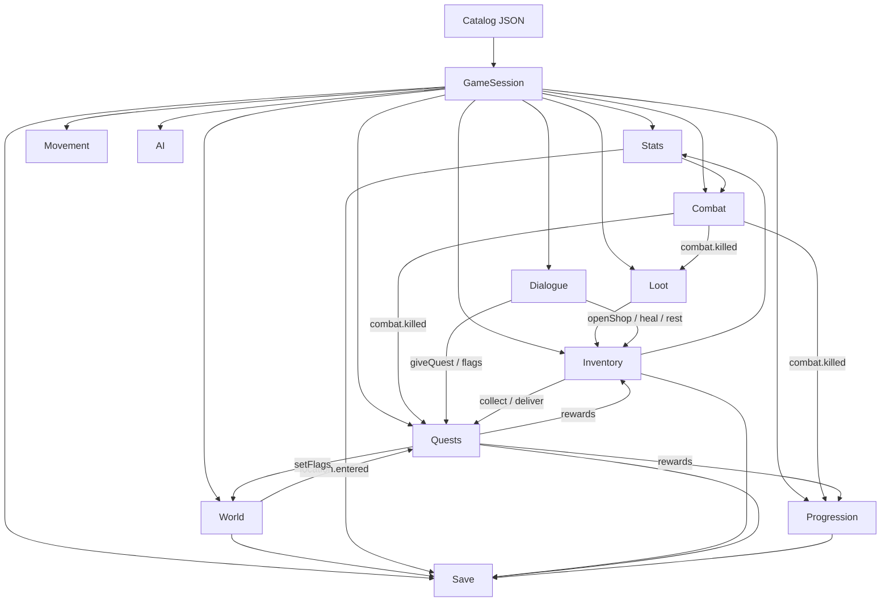

# System dependencies

Presentation never appears in this graph. Only domain/application relationships.

## Runtime graph

Arrows labeled with events are **soft** dependencies (EventBus). Unlabeled arrows are “reads catalog / shared state.”

## Allowed vs forbidden

| From | To | Allowed? |
| --- | --- | --- |
| Combat | Stats calculator | Yes, read-only function |
| Combat | QuestSystem class | No — emit `combat.killed` |
| Phaser PlayerView | damage formula | No — send `AttackIntent` |
| Dialogue runner | `setFlag` | Yes, via action commands |
| Loot | Phaser sprite list | No — emit `loot.dropped` |
| Save | any system snapshot | Yes, serialize domain only |

## Shared services

Injected by `GameSession`, used by many systems, owned by none:

- `Catalog` — immutable content
- `EventBus` — typed pub/sub
- `Rng` — seedable
- `WorldState` — current player, location, flags

## Build order (matches roadmap)

A system may be coded as a domain module before it is registered.

Registration order for a playable game:

1. WorldState + Movement (need a body in a location)
2. Combat (needs stats; use class bases until Phase 4 UI exists)
3. AI (needs combat intents)
4. Progression (needs kill/quest XP events)
5. Inventory (needs item defs; combat can ignore gear until then)
6. Loot (needs inventory)
7. Quests (needs combat + world events)
8. Dialogue (needs quests + shops)
9. Travel (needs world graph; movement already works inside one map)
10. Bosses (AI + combat + location)
11. Save (needs the snapshots from 1–10)
12. HUD polish (reads everything)

Skipping registration is fine. Deleting a working movement system in Phase 7 is not.
